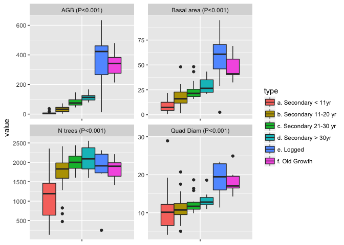

Drivers of carbon recovery in a secondary forested landscape of West Africa
================
Anny E. N'Guessan, Bruno Hérault & Justin Kassi
4/17/2018

-   [Introduction](#introduction)
    -   [Current state and drivers of deforestation/degradation in West Africa](#current-state-and-drivers-of-deforestationdegradation-in-west-africa)
    -   [What do we know about the carbon recovery rates in secondary forests ?](#what-do-we-know-about-the-carbon-recovery-rates-in-secondary-forests)
    -   [What are the possible drivers of these rates?](#what-are-the-possible-drivers-of-these-rates)
    -   [Research Questions](#research-questions)
-   [Materials & Methods](#materials-methods)
    -   [Site Description](#site-description)
    -   [Data Computation](#data-computation)
    -   [Statistical Analyses](#statistical-analyses)
-   [Results](#results)
    -   [Comparing secondary forests to logged and natural forests](#comparing-secondary-forests-to-logged-and-natural-forests-1)
-   [Discussion](#discussion)

Introduction
------------

### Current state and drivers of deforestation/degradation in West Africa

### What do we know about the carbon recovery rates in secondary forests ?

### What are the possible drivers of these rates?

### Research Questions

What are the current levels of carbon stocks in young secondary forests relatively to undisturbed (logged or not) natural forests? At which rates the carbon stocks are reconstituting? What are the main drivers of these rates?

Materials & Methods
-------------------

    ## The reference dataset contains 16467 wood density values 
    ## Your taxonomic table contains 336 taxa

### Site Description

### Data Computation

### Statistical Analyses

#### Comparing secondary forests to logged and natural forests

In order to campare the forest structure betwenn secondary, logged and natural forests in our ladnscape, we first used the Kruskall-Wallis non-parametrical tests.

Results
-------

#### Comparing secondary forests to logged and natural forests

``` r
data3$categorie<-as.character(data3$categorie)
data3[data3$categorie=="J 1-10 ans",]$categorie<-"a. Secondary < 11yr"
data3[data3$categorie=="J 11-20 ans",]$categorie<-"b. Secondary 11-20 yr"
data3[data3$categorie=="J 21-30 ans",]$categorie<-"c. Secondary 21-30 yr"
data3[data3$categorie=="J 31-40 ans",]$categorie<-"d. Secondary > 30yr"
data3[data3$categorie=="foretanci ",]$categorie<-"f. Old Growth"
data3[data3$categorie=="foretexpl ",]$categorie<-"e. Logged"
data3$categorie<-as.factor(data3$categorie)

# kruskal.test(data3$AGB,data3$categorie)
# kruskal.test(data3$BA,data3$categorie)
# kruskal.test(data3$DG,data3$categorie)
# kruskal.test(data3$N,data3$categorie)

library(ggplot2)
data_str<-data.frame(var=c(rep("AGB",dim(data3)[1]),rep("N trees",dim(data3)[1]),rep("Quad Diam",dim(data3)[1]), rep("Basal area",dim(data3)[1])),value=c(data3$AGB,data3$N,data3$DG,data3$BA),type=rep(data3$categorie,4))
data_str<-na.omit(data_str)
var<-levels(data_str$var)
data_str$var<-as.character(data_str$var)
for (i in var){
data_str[data_str$var== i,]$var<-paste(i," (P<", 0.001, ")", sep="")}
p <- ggplot(data = data_str, aes(x=var, y=value)) + 
  geom_boxplot(aes(fill=type)) +
  theme(axis.text.x=element_blank(), axis.title.x=element_blank()) #+
  #coord_flip()
p + facet_wrap( ~ var, scales="free")
```

 \`\`\`

Discussion
----------
