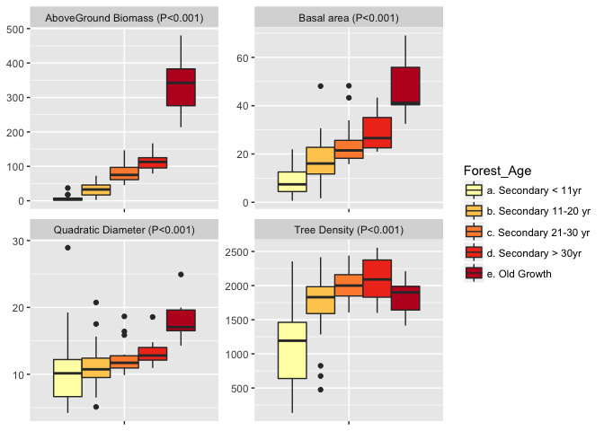
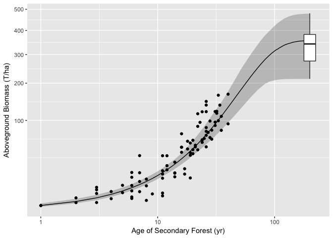

Drivers of carbon recovery in a secondary forested landscape of West Africa
================
Anny E. N'Guessan, Justin Kassi, Roselyne G. Z. Gouli, Camille Piponiot, Olivier N. Yao , Irie C Zo-Bi & Bruno Hérault
4/17/2018

-   [Introduction](#introduction)
    -   [Current state and drivers of deforestation/degradation in West Africa](#current-state-and-drivers-of-deforestationdegradation-in-west-africa)
    -   [What do we know about the carbon recovery rates in secondary forests ?](#what-do-we-know-about-the-carbon-recovery-rates-in-secondary-forests)
    -   [What are the possible drivers of these rates?](#what-are-the-possible-drivers-of-these-rates)
    -   [Research Questions](#research-questions)
-   [Materials & Methods](#materials-methods)
    -   [Site Description](#site-description)
    -   [Data Computation](#data-computation)
    -   [Statistical Analyses](#statistical-analyses)
-   [Results](#results)
    -   [Comparing secondary forests to logged and natural forests](#comparing-secondary-forests-to-logged-and-natural-forests-1)
    -   [Forest recovery rates](#forest-recovery-rates)
    -   [Environmental control on recovery rates](#environmental-control-on-recovery-rates)
-   [Discussion](#discussion)

Introduction
------------

### Current state and drivers of deforestation/degradation in West Africa

### What do we know about the carbon recovery rates in secondary forests ?

### What are the possible drivers of these rates?

### Research Questions

What are the current levels of carbon stocks in young secondary forests relatively to undisturbed (logged or not) natural forests? At which rates the carbon stocks are reconstituting? What are the main drivers of these rates?

Materials & Methods
-------------------

``` r
library(BIOMASS)
data1<-read.csv2("arbrestotals.csv")
```

``` r
######## Taxonomic correction
# Taxo<-correctTaxo(genus = data1$genus, species = data1$species)
# data1$genusCorr <- Taxo$genusCorrected
# table(data1$genus==data1$genusCorr)
# data1$speciesCorr <- Taxo$speciesCorrected
# table(data1$species==data1$speciesCorr)
# # correction des familles avec APG III
# APG <- getTaxonomy(data1$genusCorr, findOrder = T)
# data1$familyAPG <- APG$family
# data1$orderAPG <- APG$order
# save(data1, file="data1.Rdata")
load(file="data1.Rdata")
######### Wood density
dataWD<-getWoodDensity(genus=data1$genusCorr,
                       species=data1$speciesCorr,stand= data1$plot) 
```

    ## The reference dataset contains 16467 wood density values 
    ## Your taxonomic table contains 336 taxa

``` r
data1$WD = dataWD$meanWD
data1$WDsd=dataWD$sdWD
########## Diameter
data1$circ<-as.numeric(as.character(data1$circ))
data1$H<-as.numeric(as.character(data1$H))
data1$D<-data1$circ/pi
########## Biomass computation per individual
AGBtree<-computeAGB(D=data1$D, WD=data1$WD, H=data1$H)
data1$AGB=AGBtree
########## Biomass computation per plot
AGBPlot1<-tapply(data1$AGB,data1$plot,sum)
AGBPlot1ha=AGBPlot1/0.2
#head(AGBPlot1ha)
########## Stand Density per plot
nplot<-table(data1$plot) 
dplotha<-nplot/0.2
#head(dplotha)
########## Basal Area per plot
data1$S<-(data1$D/100)^2*pi/4
SPlot<-tapply(data1$S,data1$plot,sum)
SPlot<-SPlot/0.2
#head(SPlot)
########## Quadratic Diameter per plot
DG<-sqrt(tapply((data1$D)^2,data1$plot,mean))
#head(DG)
########## Biomass Computation without remnant trees
data2=data1[data1$rem==0,]
AGBPlot2<-tapply(data2$AGB,data2$plot,sum)
AGBPlot2ha=AGBPlot2/0.2
#head(AGBPlot2ha)
########## creating a new dataframe per plot
data3<-read.csv2("variables.csv", dec=".")
data3$AGB.Kg.ha._avec.rem<-NULL
data3$AGB.Kg.ha._sans.rem<-NULL
data3$densit.<-NULL
data3$surface.terri.re<-NULL
data3$AGB<-as.numeric(as.character(AGBPlot2ha))
data3$N<-as.numeric(as.character(dplotha))
data3$BA<-as.numeric(as.character(SPlot))
data3$DG<-as.numeric(as.character(DG))
```

### Site Description

### Data Computation

### Statistical Analyses

#### Comparing secondary forests to logged and natural forests

In order to campare the forest structure betwenn secondary, logged and natural forests in our ladnscape, we first used the Kruskall-Wallis non-parametrical tests.

Results
-------

### Comparing secondary forests to logged and natural forests

``` r
data3$categorie<-as.character(data3$categorie)
data3[data3$categorie=="J 1-10 ans",]$categorie<-"a. Secondary < 11yr"
data3[data3$categorie=="J 11-20 ans",]$categorie<-"b. Secondary 11-20 yr"
data3[data3$categorie=="J 21-30 ans",]$categorie<-"c. Secondary 21-30 yr"
data3[data3$categorie=="J 31-40 ans",]$categorie<-"d. Secondary > 30yr"
data3[data3$categorie=="foretanci ",]$categorie<-"e. Old Growth"
data3[data3$categorie=="foretexpl ",]$categorie<-"e. Logged"
#### dropping logged forests
data3<-data3[!data3$categorie=="e. Logged",]
data3$categorie<-as.factor(data3$categorie)
# kruskal.test(data3$AGB,data3$categorie)
# kruskal.test(data3$BA,data3$categorie)
# kruskal.test(data3$DG,data3$categorie)
# kruskal.test(data3$N,data3$categorie)
```

``` r
library(ggplot2)
data_str<-data.frame(var=c(rep("AGB",dim(data3)[1]),rep("N trees",dim(data3)[1]),rep("Quad Diam",dim(data3)[1]), rep("Basal area",dim(data3)[1])),value=c(data3$AGB,data3$N,data3$DG,data3$BA),type=rep(data3$categorie,4))
data_str<-na.omit(data_str)
var<-levels(data_str$var)
data_str$var<-as.character(data_str$var)
for (i in var){
data_str[data_str$var== i,]$var<-paste(i," (P<", 0.001, ")", sep="")}
p <- ggplot(data = data_str, aes(x=var, y=value)) + 
  geom_boxplot(aes(fill=type)) +
  theme(axis.text.x=element_blank(), axis.title.x=element_blank()) #+
  #coord_flip()
p + facet_wrap( ~ var, scales="free")
```



### Forest recovery rates

``` r
agbmax<-quantile(data3[data3$categorie %in% c("e. Old Growth"),]$AGB, 0.75)
data4<-data3[!data3$categorie %in% c("e. Old Growth"),]
data5<-data3[data3$categorie %in% c("e. Old Growth"),]
data5$age<-200
data4$lambda<- -log(1-(data4$AGB/agbmax))/((data4$age/10)^2)
q<-quantile(data4$lambda, probs=c(0.05, 0.5, 0.95))
```

``` r
library(ggplot2)
age<-1:200
newdata <- data.frame(age=age, med=agbmax*(1-exp(-q[2]*((age/10)^2))), q05=agbmax*(1-exp(-q[1]*((age/10)^2))),
                    q95= agbmax*(1-exp(-q[3]*((age/10)^2))))
ggplot() +
  geom_ribbon(data=newdata, aes(x=age, ymin = q05, ymax = q95), alpha = .25)+
  geom_point(data=data4, aes(x = age, y=AGB))+
  geom_point(data=data5, aes(x=age, y=AGB, colour="red"))+
  scale_y_sqrt()+
  scale_x_log10()+
  xlab("Age of Secondary Forest (yr)") + ylab("Aboveground Biomass (T/ha)")
```



### Environmental control on recovery rates

``` r
str(data4)
```

    ## 'data.frame':    89 obs. of  17 variables:
    ##  $ plot                : int  1 2 4 6 7 8 10 12 17 18 ...
    ##  $ categorie           : Factor w/ 5 levels "a. Secondary < 11yr",..: 2 1 3 3 1 4 2 4 2 4 ...
    ##  $ age                 : int  11 3 26 21 5 32 17 34 20 35 ...
    ##  $ nbr_remanent        : int  5 7 16 1 7 2 1 2 6 0 ...
    ##  $ shannon             : num  2.42 1.84 3.16 3.52 1.88 ...
    ##  $ Proximiteforesti.re.: int  300 500 150 10 500 10 50 10 210 10 ...
    ##  $ Densiteforesti.re.  : int  3 0 1 5 1 5 4 7 4 4 ...
    ##  $ Altitude            : int  135 96 106 118 124 120 122 99 129 119 ...
    ##  $ Annedeculture       : int  2 2 3 10 3 3 3 6 10 10 ...
    ##  $ Typedesol           : Factor w/ 2 levels "solferralitique",..: 1 2 2 1 1 1 1 1 1 1 ...
    ##  $ Topographie         : Factor w/ 7 levels "bas fond","bas pente",..: 7 1 6 5 5 5 7 5 5 5 ...
    ##  $ Precedentcultural   : Factor w/ 5 levels "cacao","igname",..: 3 5 1 1 3 1 3 1 1 1 ...
    ##  $ AGB                 : num  12.729 0.753 146.648 52.435 3.846 ...
    ##  $ N                   : num  1285 285 1765 1790 1485 ...
    ##  $ BA                  : num  7.71 2.12 48.26 17.61 4.35 ...
    ##  $ DG                  : num  8.74 9.73 18.66 11.19 6.11 ...
    ##  $ lambda              : num  0.0279 0.0219 0.0714 0.0334 0.0404 ...

``` r
model<-lm(lambda~log(nbr_remanent+1)+shannon+log(Proximiteforesti.re.+1)+log(Densiteforesti.re.+1)+Altitude+log(Annedeculture+1)+Typedesol+Precedentcultural, data=data4)
summary(model)
```

    ## 
    ## Call:
    ## lm(formula = lambda ~ log(nbr_remanent + 1) + shannon + log(Proximiteforesti.re. + 
    ##     1) + log(Densiteforesti.re. + 1) + Altitude + log(Annedeculture + 
    ##     1) + Typedesol + Precedentcultural, data = data4)
    ## 
    ## Residuals:
    ##       Min        1Q    Median        3Q       Max 
    ## -0.054859 -0.013633 -0.002287  0.010989  0.135133 
    ## 
    ## Coefficients:
    ##                                 Estimate Std. Error t value Pr(>|t|)    
    ## (Intercept)                    0.1128581  0.0599683   1.882   0.0636 .  
    ## log(nbr_remanent + 1)          0.0158918  0.0038015   4.180 7.62e-05 ***
    ## shannon                       -0.0073655  0.0107164  -0.687   0.4940    
    ## log(Proximiteforesti.re. + 1) -0.0070113  0.0043621  -1.607   0.1121    
    ## log(Densiteforesti.re. + 1)   -0.0038907  0.0108778  -0.358   0.7216    
    ## Altitude                      -0.0002111  0.0002675  -0.789   0.4325    
    ## log(Annedeculture + 1)        -0.0028257  0.0066846  -0.423   0.6737    
    ## Typedesolsolhydromorphe       -0.0107970  0.0091441  -1.181   0.2413    
    ## Precedentculturaligname        0.0171447  0.0173539   0.988   0.3263    
    ## Precedentculturalmanioc        0.0242084  0.0131418   1.842   0.0693 .  
    ## Precedentculturalma\357s       0.0198635  0.0142180   1.397   0.1664    
    ## Precedentculturalriz          -0.0156545  0.0167485  -0.935   0.3529    
    ## ---
    ## Signif. codes:  0 '***' 0.001 '**' 0.01 '*' 0.05 '.' 0.1 ' ' 1
    ## 
    ## Residual standard error: 0.02944 on 77 degrees of freedom
    ## Multiple R-squared:  0.4171, Adjusted R-squared:  0.3338 
    ## F-statistic: 5.008 on 11 and 77 DF,  p-value: 7.745e-06

``` r
model1<-step(model)
```

    ## Start:  AIC=-616.43
    ## lambda ~ log(nbr_remanent + 1) + shannon + log(Proximiteforesti.re. + 
    ##     1) + log(Densiteforesti.re. + 1) + Altitude + log(Annedeculture + 
    ##     1) + Typedesol + Precedentcultural
    ## 
    ##                                 Df Sum of Sq      RSS     AIC
    ## - log(Densiteforesti.re. + 1)    1 0.0001109 0.066833 -618.28
    ## - log(Annedeculture + 1)         1 0.0001548 0.066877 -618.23
    ## - shannon                        1 0.0004093 0.067131 -617.89
    ## - Altitude                       1 0.0005396 0.067261 -617.71
    ## - Typedesol                      1 0.0012081 0.067930 -616.83
    ## - Precedentcultural              4 0.0061828 0.072905 -616.54
    ## <none>                                       0.066722 -616.43
    ## - log(Proximiteforesti.re. + 1)  1 0.0022387 0.068960 -615.49
    ## - log(nbr_remanent + 1)          1 0.0151433 0.081865 -600.23
    ## 
    ## Step:  AIC=-618.28
    ## lambda ~ log(nbr_remanent + 1) + shannon + log(Proximiteforesti.re. + 
    ##     1) + Altitude + log(Annedeculture + 1) + Typedesol + Precedentcultural
    ## 
    ##                                 Df Sum of Sq      RSS     AIC
    ## - log(Annedeculture + 1)         1 0.0001653 0.066998 -620.06
    ## - Altitude                       1 0.0004375 0.067270 -619.70
    ## - shannon                        1 0.0005717 0.067404 -619.53
    ## - Typedesol                      1 0.0010982 0.067931 -618.83
    ## - Precedentcultural              4 0.0060991 0.072932 -618.51
    ## <none>                                       0.066833 -618.28
    ## - log(Proximiteforesti.re. + 1)  1 0.0023883 0.069221 -617.16
    ## - log(nbr_remanent + 1)          1 0.0160928 0.082925 -601.08
    ## 
    ## Step:  AIC=-620.06
    ## lambda ~ log(nbr_remanent + 1) + shannon + log(Proximiteforesti.re. + 
    ##     1) + Altitude + Typedesol + Precedentcultural
    ## 
    ##                                 Df Sum of Sq      RSS     AIC
    ## - Altitude                       1 0.0004401 0.067438 -621.48
    ## - shannon                        1 0.0007358 0.067734 -621.09
    ## - Typedesol                      1 0.0010031 0.068001 -620.74
    ## <none>                                       0.066998 -620.06
    ## - Precedentcultural              4 0.0077787 0.074777 -618.29
    ## - log(Proximiteforesti.re. + 1)  1 0.0030674 0.070065 -618.08
    ## - log(nbr_remanent + 1)          1 0.0165220 0.083520 -602.45
    ## 
    ## Step:  AIC=-621.48
    ## lambda ~ log(nbr_remanent + 1) + shannon + log(Proximiteforesti.re. + 
    ##     1) + Typedesol + Precedentcultural
    ## 
    ##                                 Df Sum of Sq      RSS     AIC
    ## - Typedesol                      1 0.0005693 0.068007 -622.73
    ## - shannon                        1 0.0006447 0.068083 -622.63
    ## <none>                                       0.067438 -621.48
    ## - Precedentcultural              4 0.0073583 0.074796 -620.26
    ## - log(Proximiteforesti.re. + 1)  1 0.0030510 0.070489 -619.54
    ## - log(nbr_remanent + 1)          1 0.0167694 0.084208 -603.72
    ## 
    ## Step:  AIC=-622.73
    ## lambda ~ log(nbr_remanent + 1) + shannon + log(Proximiteforesti.re. + 
    ##     1) + Precedentcultural
    ## 
    ##                                 Df Sum of Sq      RSS     AIC
    ## - shannon                        1  0.000527 0.068534 -624.05
    ## <none>                                       0.068007 -622.73
    ## - log(Proximiteforesti.re. + 1)  1  0.003451 0.071458 -620.33
    ## - Precedentcultural              4  0.010465 0.078473 -617.99
    ## - log(nbr_remanent + 1)          1  0.016750 0.084758 -605.14
    ## 
    ## Step:  AIC=-624.05
    ## lambda ~ log(nbr_remanent + 1) + log(Proximiteforesti.re. + 1) + 
    ##     Precedentcultural
    ## 
    ##                                 Df Sum of Sq      RSS     AIC
    ## <none>                                       0.068534 -624.05
    ## - log(Proximiteforesti.re. + 1)  1 0.0031916 0.071726 -621.99
    ## - Precedentcultural              4 0.0109972 0.079532 -618.80
    ## - log(nbr_remanent + 1)          1 0.0164222 0.084957 -606.93

``` r
summary(model1)
```

    ## 
    ## Call:
    ## lm(formula = lambda ~ log(nbr_remanent + 1) + log(Proximiteforesti.re. + 
    ##     1) + Precedentcultural, data = data4)
    ## 
    ## Residuals:
    ##       Min        1Q    Median        3Q       Max 
    ## -0.051779 -0.015261 -0.003418  0.010121  0.142315 
    ## 
    ## Coefficients:
    ##                                Estimate Std. Error t value Pr(>|t|)    
    ## (Intercept)                    0.042162   0.010458   4.032 0.000123 ***
    ## log(nbr_remanent + 1)          0.016176   0.003649   4.433 2.86e-05 ***
    ## log(Proximiteforesti.re. + 1) -0.005368   0.002747  -1.954 0.054092 .  
    ## Precedentculturaligname        0.023496   0.014883   1.579 0.118251    
    ## Precedentculturalmanioc        0.029428   0.010615   2.772 0.006884 ** 
    ## Precedentculturalma\357s       0.027724   0.011254   2.464 0.015850 *  
    ## Precedentculturalriz          -0.006894   0.013999  -0.492 0.623725    
    ## ---
    ## Signif. codes:  0 '***' 0.001 '**' 0.01 '*' 0.05 '.' 0.1 ' ' 1
    ## 
    ## Residual standard error: 0.02891 on 82 degrees of freedom
    ## Multiple R-squared:  0.4012, Adjusted R-squared:  0.3574 
    ## F-statistic: 9.158 on 6 and 82 DF,  p-value: 1.151e-07

Effect of the number of residual trees on Lambda

``` r
ggplot(data4, aes(log(nbr_remanent+1),lambda)) + geom_point() + geom_smooth() +
    xlab("log(Number of residual trees +1)") + ylab("Recovery rate")
```

    ## `geom_smooth()` using method = 'loess'


Effect of the precedent crop

``` r
ggplot(data4, aes(x=Precedentcultural,y=lambda, fill=Precedentcultural)) + geom_boxplot() +
    xlab("Precedent Crop") + ylab("Recovery rate")
```


Discussion
----------
